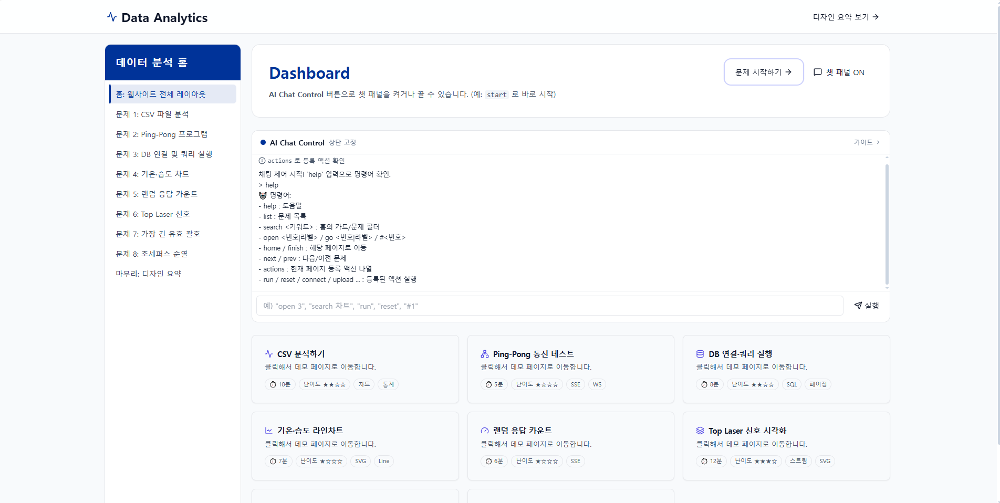
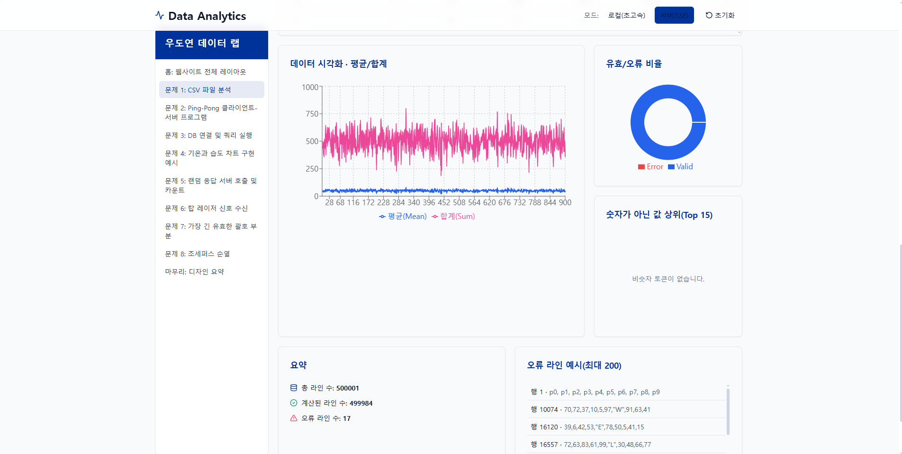
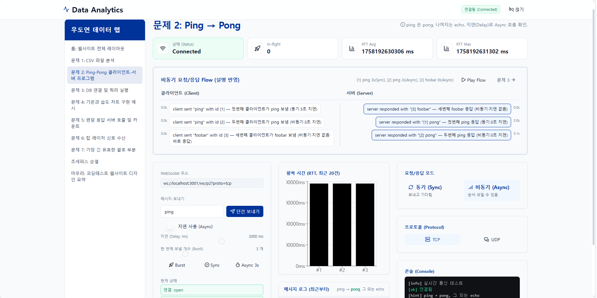
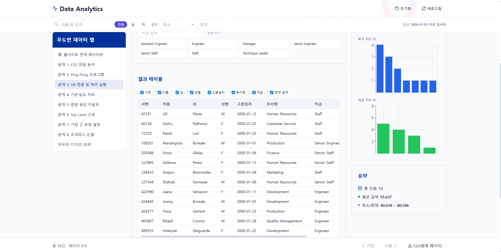
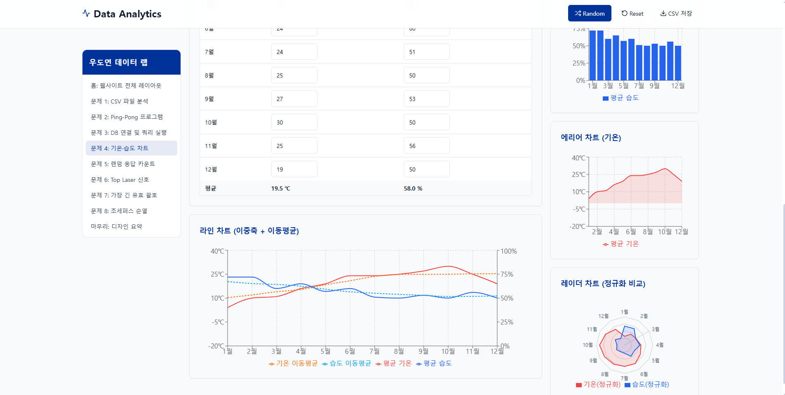
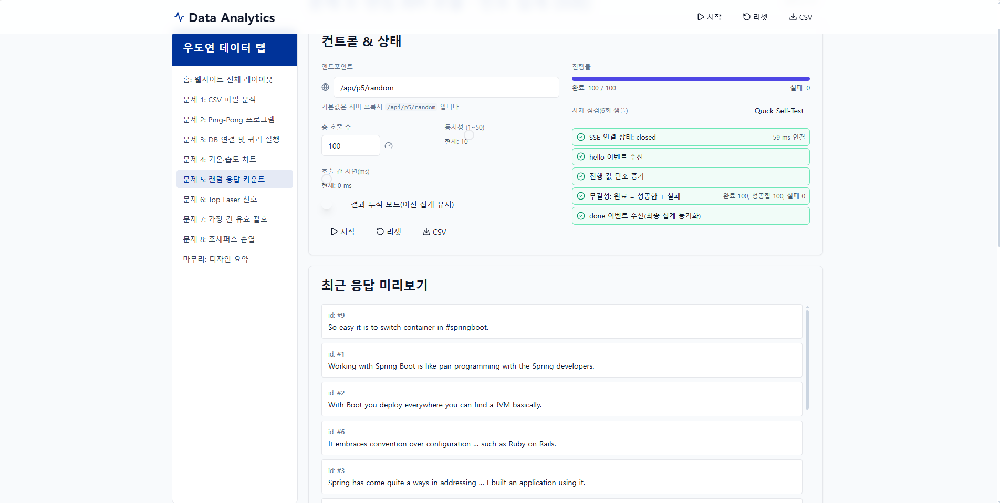
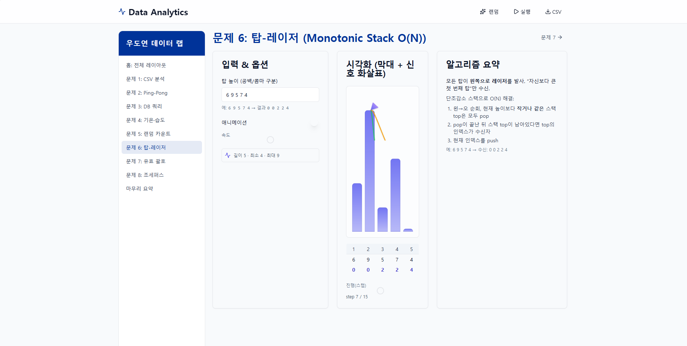
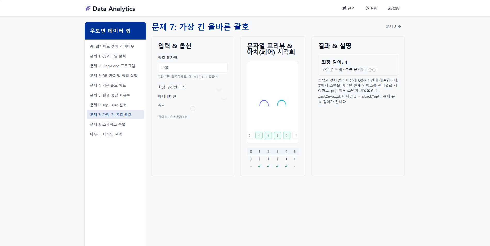
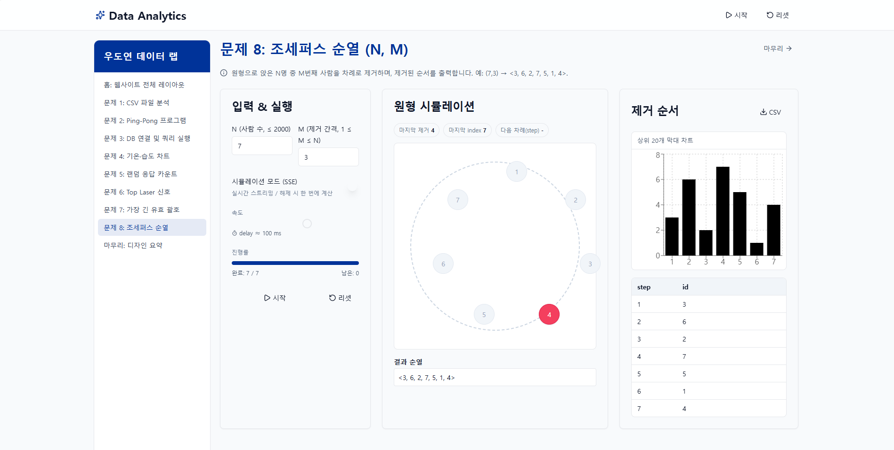
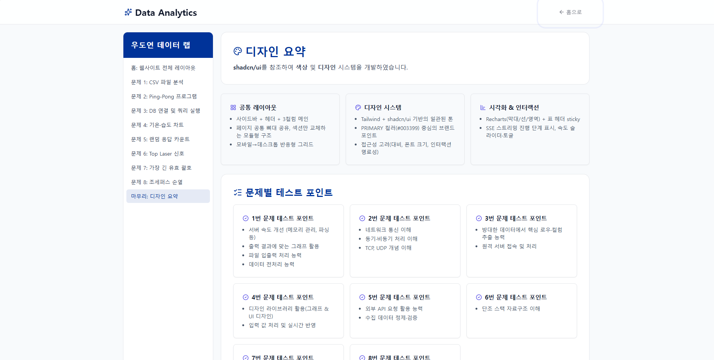

# 📊 AI Analytics Dashboard — 데이터 분석 자동화 & 시각화

파일·DB·API에서 수집한 데이터를 한 곳에서 **정제 → 분석 → 시각화**하고, **AI 요약·RAG 질의응답**까지 확장 가능한 개인 프로젝트입니다.
React + TypeScript 기반으로 **실시간 차트**, **데이터 파이프라인 데모**, **알고리즘 시각화** 등을 제공합니다.

<p align="left">
  <a href="./Analytics.mp4"><b>🎬 시연 동영상 보기</b></a>
</p>

---

## 🔎 목차

* [핵심 가치 (Why)](#-핵심-가치-why)
* [주요 기능 (What)](#-주요-기능-what)
* [기술 스택 (How)](#-기술-스택-how)
* [빠른 시작](#-빠른-시작)
* [대표 화면 & 설명](#-대표-화면--설명)

  * [홈: 대시보드](#홈-대시보드)
  * [문제 1: CSV 파일 분석](#문제-1-csv-파일-분석)
  * [문제 2: Ping-Pong 통신](#문제-2-ping-pong-통신)
  * [문제 3: DB 연결 & 쿼리](#문제-3-db-연결--쿼리)
  * [문제 4: 기온·습도 차트](#문제-4-기온습도-차트)
  * [문제 5: 랜덤 응답 카운트(SSE)](#문제-5-랜덤-응답-카운트SSE)
  * [문제 6: Top Laser (Monotonic Stack)](#문제-6-top-laser-monotonic-stack)
  * [문제 7: 가장 긴 유효한 괄호](#문제-7-가장-긴-유효한-괄호)
  * [문제 8: 조세퍼스 순열](#문제-8-조세퍼스-순열)
  * [마무리: 디자인 요약](#마무리-디자인-요약)
* [API 예시](#-api-예시)
* [품질 & 로드맵](#-품질--로드맵)
* [라이선스 & 문의](#-라이선스--문의)

---

## ✨ 핵심 가치 (Why)

* **한 곳에서 분석**: 파일·DB·API 등 소스가 달라도 하나의 대시보드에서 통합 분석
* **즉시 시각화**: 입력/갱신 데이터가 실시간 차트로 반영
* **AI 확장성**: 요약(LLM) + RAG 질의응답 구조를 고려한 설계
* **개발 효율**: 타입 안정성(TypeScript), 재사용 가능한 컴포넌트, 미니멀 UI

## 🧩 주요 기능 (What)

* **데이터 수집 파이프라인**: CSV 업로드/파싱, DB/REST API 비동기 수집
* **전처리 & 통계**: 유효성 검사, 오류 행 분리, 합/평균/표준편차 등 요약 통계
* **실시간 시각화**: Recharts 기반 라인/막대/에어리어 차트, 반응형 레이아웃
* **AI 요약 & RAG(옵션)**: 요약/인사이트 초안, 임베딩·벡터검색 연동 지점 제공
* **UX 보조**: 랜덤 데이터 주입, 다크 모드(선택), 접근성 고려

## 🛠 기술 스택 (How)

**Frontend**: React, TypeScript, Vite, Tailwind, shadcn/ui, Recharts
**Backend**: Node.js(Express)
**Data/AI(옵션)**: CSV/REST, (옵션) OpenAI·Vector DB
**Dev**: ESLint, Prettier, GitHub Actions

---

## 🚀 빠른 시작

```bash
# 1) 의존성
npm i -g pnpm@9
pnpm install

# 2) 서버 (백엔드)
cd apps/server
cp .env.example .env
pnpm dev   # http://localhost:3001

# 3) 웹 (프론트)
cd ../web
cp .env.example .env   # VITE_API_BASE=http://localhost:3001
pnpm dev   # http://localhost:5173
```

---

## 🖼 대표 화면 & 설명


### 홈: 대시보드



* **AI Chat Control**로 카드/문제 페이지를 명령형으로 제어
* 각 카드에서 데모 페이지로 이동해 **즉시 실행** 가능

---

### 문제 1: CSV 파일 분석



* **스트리밍 파싱(선택)** + 스키마 검증 → **오류 행 분리**
* 유효/오류 비율 도넛, 상위 비숫자 토큰, 기본 통계(합·평균 등)

---

### 문제 2: Ping-Pong 통신



* **WebSocket**으로 클라이언트–서버 간 **Sync/Async** 플로우 시뮬레이션
* 최근 20개 **RTT(왕복시간)** 차트, 메시지 로그, 프로토콜(TCP/UDP) 토글

---

### 문제 3: DB 연결 & 쿼리



* 날짜/성별/부서/직급 필터 → 테이블 & 차트 동기화
* 요약 통계: 인원, 평균 급여, 최소/최대 급여

---

### 문제 4: 기온·습도 차트



* 월별 입력값 → 라인/막대/에어리어 **복합 시각화**
* 이동평균, 정규화 레이더 차트로 **패턴 비교**

---

### 문제 5: 랜덤 응답 카운트(SSE)



* **Server-Sent Events**로 1\~50 동시성, 회수·지연 제어
* 진행률/결과 누적 모드, 최근 응답 미리보기

---

### 문제 6: Top Laser (Monotonic Stack)



* 막대 그래프 + **레이저 시각화**로 **단조 스택 O(N)** 풀이 과정을 단계별 표시
* 스텝 인덱스, push/pop 과정이 **UI에 그대로 설명**

---

### 문제 7: 가장 긴 유효한 괄호



* 스택 기반 알고리즘을 **프리뷰/페어 시각화**로 확인
* 최장 길이, 구간, 부분 문자열을 결과로 출력

---

### 문제 8: 조세퍼스 순열



* 원형 시뮬레이터로 제거 순서를 **단계별 애니메이션**
* 오른쪽 차트/테이블에 **제거 순서 기록** + CSV 저장

---

### 마무리: 디자인 요약



* **공통 레이아웃**(사이드바+헤더+3컬럼)
* **디자인 시스템**: Tailwind + shadcn/ui, 브랜드 컬러(#003399)
* **시각화 가이드**: Recharts, 표 헤더 sticky, SSE 단계 표시, 속도 컨트롤 등

---

## 🔌 API 예시

```
GET  /api/data/mock           # 데모 데이터
POST /api/data/upload         # CSV 업로드(멀티파트)
GET  /api/data/series         # 시계열 조회 (from, to)

# (옵션: AI)
POST /api/ai/summarize        # 요약
POST /api/ai/rag-query        # 벡터검색+Q&A
```

---

## ✅ 품질 & 로드맵

**품질**

* Jest 유닛 테스트(통계 유틸, 파서/밸리데이터)
* ESLint + TypeScript strict, GitHub Actions(빌드/테스트)

**로드맵**

* [ ] 대규모 스트리밍 차트 최적화(수만\~수십만 포인트)
* [ ] 파이프라인 플로우(노드-엣지) 시각화
* [ ] 대시보드 프리셋 저장/공유
* [ ] 멀티 소스 조인(파일+API 혼합 집계)
* [ ] RAG 샘플(벡터 DB 선택 가이드)
* [ ] 접근성 & i18n 강화

---

## 📜 라이선스 & 문의

* 학습·포트폴리오 목적 공개. 외부 API/모델은 각 서비스 약관 준수.
* Author: **우도연 (Full-stack · AI-PM)**
* GitHub: [woodoyeon](https://github.com/woodoyeon)
* Project: `AI Analytics Dashboard` (2025.09\~ 진행중)

---

### 📂 이미지 배치 팁

```
/ (repo root)
├─ README.md
└─ docs/
   ├─ 홈.png
   ├─ 문제1.PNG
   ├─ 문제2.PNG
   ├─ 문제3.PNG
   ├─ 문제4.PNG
   ├─ 문제5.PNG
   ├─ 문제6.PNG
   ├─ 문제7.PNG
   ├─ 문제8.PNG
   └─ 마무리.PNG
```


